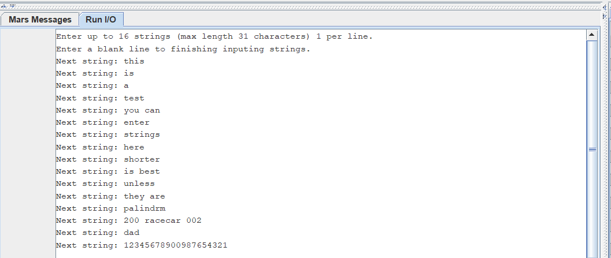
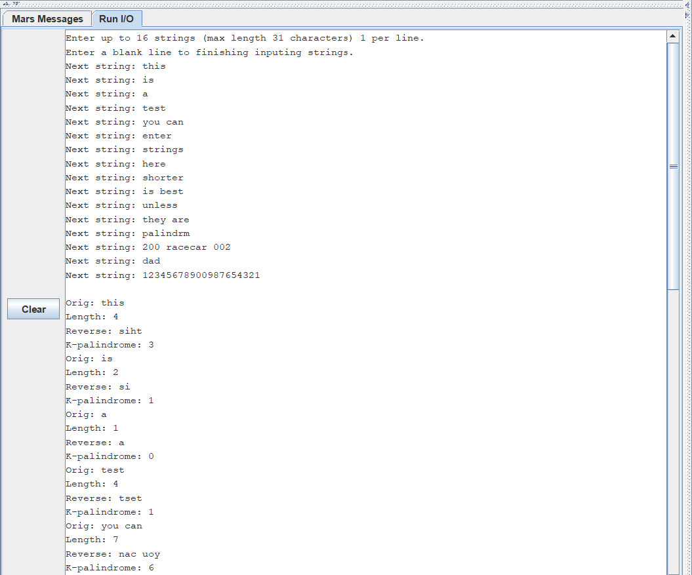
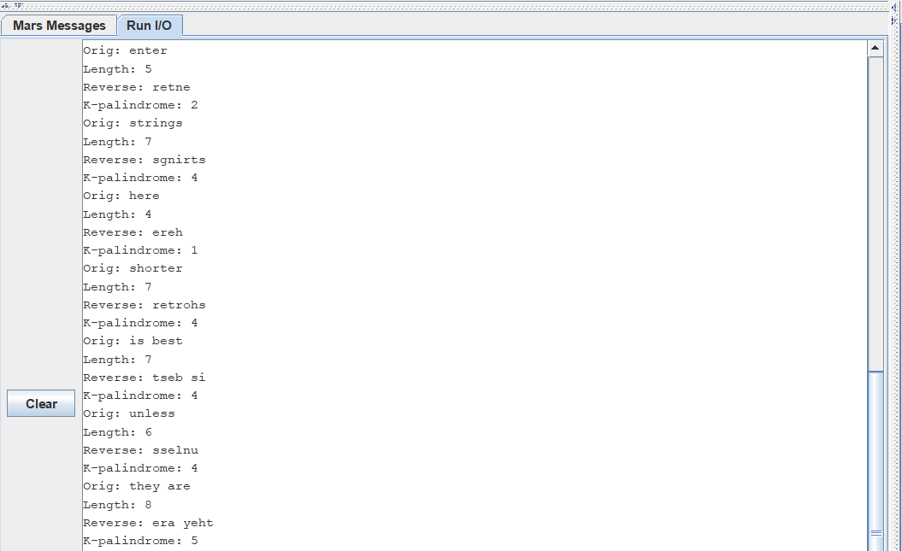
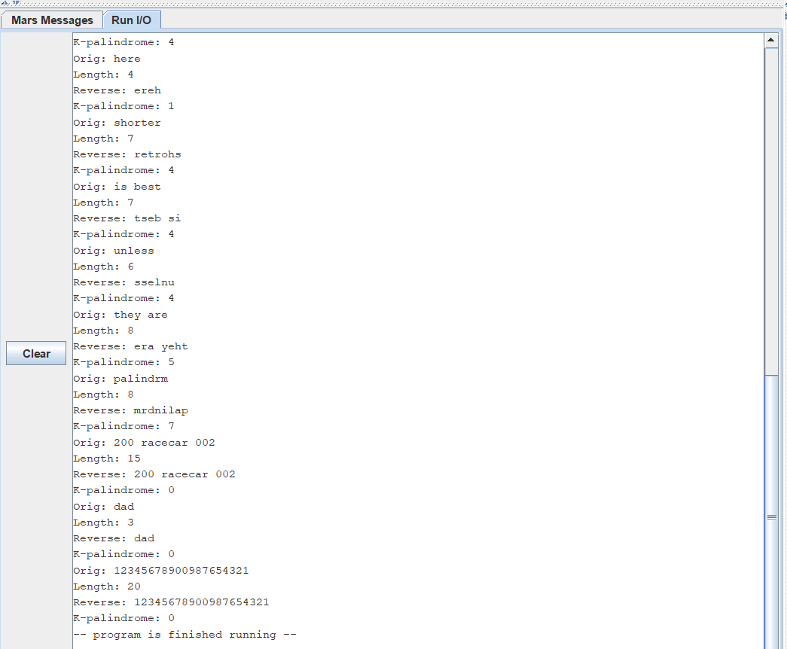

# Module 6 Challenge Activity: MIPS Procedures Recursion and Cache

- [Module 6 Challenge Activity: MIPS Procedures Recursion and Cache](#module-4-challenge-activity-mips-procedures-recursion-and-cache)
	- [Learning Activities](#learning-activities)
	- [Purpose](#purpose)
	- [Skills and Knowledge](#skills-and-knowledge)
	- [Overview](#overview)
	- [Task 1: Ask user for Input](#task-1-ask-user-for-input)
		- [Sample Output Task 1](#sample-output-task-1)
	- [Task 2: Calculate string length](#task-2-calculate-string-length)
	- [Task 3: Reverse the string](#task-3-reverse-the-string)
	- [Task 4: Calculate 2k k-palindrome value](#task-4-calculate-2k-k-palindrome-value)
	- [Task 5: Print out results](#task-5-print-out-results)
		- [Sample Output](#sample-output)
	- [Task 6: Measure cache performance](#task-6-measure-cache-performance)
	- [Test it in main](#test-it-in-main)
	- [Submission Checklist](#submission-checklist)

## Learning Activities

The learning activities related to this assignment are in the `la` folder of this
project. If you need to review the concepts, follow the [LA description](la/README.md)

## Purpose

The purpose of this assignment is to give you additional practice working with
procedures that call procedures in MIPS.  We will also explore the effect of
Caching on your code

## Skills and Knowledge

By the end of this assignment, you should feel comfortable:

1. Calling a procedure from another procedure
2. Allocating space on the stack for local variables
3. Using recursion in MIPS
4. Understanding how the Cache works

## Overview

For this challenge activity you will be writing a program the asks the user to
enter a series of strings.  You will then perform several calculations on those
strings and print out the results.

Follow the directions closely.  In several places you could solve the problem
multiple ways but you part of your grade will be based on using the required
approach.  For example, There are methods that require you to use recursion or
to allocate an array on the stack.  Failure to do so may pass all the tests but
will not earn you full credit.

## Task 1: Ask user for input

Your first task is to collect user input and store it in a global array.
First, prompt the user to enter a string (max 31 characters) and store the result
in the global array.
You should not include the newline character as part of the
string.
I recommend that you truncate the newline character right after reading the string.
You should continue to allow the user to enter a string (up to 16 total strings).
If the user enters an empty string (i.e. a blank line) then you should stop the
input loop early (i.e. do not continue to prompt for more strings)

Warning: If a string that is more than ~8 characters long and is not a palindrome
is entered, the k-palindrome procedure may take a long time to complete.

Begin working in the file template (`ca.asm`) provided in the `ca` folder.

```mips
# Author:
# Date:
# Description:

.globl main			# Do not remove this line

# Data for the program goes here
.data

#Arrays to store the user inputted strings and the reverse.
strings: .space 512  #16 strings of up to 32 characters each including the null character
reversed: .space 512 #16 strings of up to 32 characters each including the null character
# Create additional arrays here if needed

.text
main:

	# Step 1: Read user-inputted strings
	# Step 2: Calculate string lengths
	# Step 3: Reverse the strings
	# Step 4: Compute 2k k-palindrome value
	# Step 5: Print the results

exit_main:
	li   $v0, 10			# 10 is the exit program syscall
	syscall				# execute call

###############################################################
# Calculates 2k where k is the minimum number of deletions required to
# turn a string into a palindrome.
#
# Argument parameters:
# $a0 - the address of the string
# $a1 - the address of the string in reverse
# $a0 - the length of the string
# $a1 - the length of the string in reverse
# $v0 - 2*k where k is the minimum number of deletions required to convert the
#       string in $a0 into a palindrome.
k_palindrome:				#(string X, string Y, int m, int n)

end_k_palindrome:

###############################################################
# Reverses a null-terminated string and stores the result at the specified location
# Assumes that the string is 31 characters or less and that the result Address
# has enough space for the entire string (including the null character).
# Creates a local array for storing the intermediate result.
#
# Argument parameters:
# $a0 - Address of the string
# $a1 - Address of the result
reverse_string:

end_reverse_string:


###############################################################
# Calculates the length of a null-terminated string
#
# Argument parameters:
# $a0 - Address of the string
# Return Value:
# $v0 - number of characters in the string (do not count the null character)
strlen:

end_strlen:

# Add additional procedures here if needed

## end of ca.asm
```

### Sample Output Task 1



## Task 2: Calculate string length

Your next task is to create a procedure called `strlen` that will count the number
of characters in a string and return the result.  The null character is used to
mark the end of a string and does not count as one of the characters.
You will need to call this function once for each string that was entered during
[Task 1](#task-1-ask-user-for-input).
Your procedure will take the address of the string in a register `$a0`.
It should return the number of character in that string in register `$v0`.

The procedure should have the following signature:

```mips
###############################################################
# Calculates the length of a null-terminated string
#
# Argument parameters:
# $a0 - Address of the string
# Return Value:
# $v0 - number of characters in the string (do not count the null character)
strlen:
	...
end_strlen:
	...
	jr    $ra
```

## Task 3: Reverse the string

Your next task is to create a procedure called `reverse_string` that will reverse
the string and store the result at a specified location.
You will need to call this function once for each string that was entered during
[Task 1](#task-1-ask-user-for-input).
Your procedure will take the address of the string in a register `$a0`.
It should take the address of the location to store the reversed string in `$a1`.
It does not need to return a value.
Your procedure **must** allocate a local array on the stack to store the
intermediate results.  You can assume that the string is 31 characters or less.
You **must** store the string in reverse to this local array and then copy the result
to the address specified in `$a1`.

The procedure should have the following signature:

```mips
###############################################################
# Reverses a null-terminated string and stores the result at the specified location
# Assumes that the string is 31 characters or less and that the result Address
# has enough space for the entire string (including the null character).
# Creates a local array for storing the intermediate result.
#
# Argument parameters:
# $a0 - Address of the string
# $a1 - Address of the result
reverse_string:
	...
end_reverse_string:
	...
	jr    $ra
```


## Task 4: Calculate 2k k-palindrome value

Your next task is to create a procedure called `k_palindrome` that will
compute the minimum value of k to create a valid k-palindrome.
You will need to call this function once for each string that was entered during
[Task 1](#task-1-ask-user-for-input).
You **must** implement this procedure using recursion.
You do not have to figure out the logic for this procedure on your own.
Instead it is recommended that you translate the recursive solution from this
[site](https://www.techiedelight.com/check-given-string-k-palindrome-not/).

A high-level language version of the code is shown below:

```c++
// Function to check if the given string is K-Palindrome or not
int isKPalindrome(string X, int m, string Y, int n)
{
	// if either string is empty, return the sum of the lengths
	if (m == 0 || n == 0)
		return n + m;

	// ignore last characters of both strings if they are same
	// and recur for remaining characters
	if (X[m - 1] == Y[n - 1])
		return isKPalindrome(X, m - 1, Y, n - 1);

	// if last character of both strings is different

	// ignore last character from the first string and recur
	int x = isKPalindrome(X, m - 1, Y, n);

	// ignore last character from the second string and recur
	int y = isKPalindrome(X, m, Y, n - 1);

	// return minimum of above two operations plus one
	return 1 + min(x, y);
}
```

Your procedure will take the address of the string in register `$a0`, the address
of the reverse string in register `$a1`, the length of the string in `$a2`, and
the length of the reverse string in `$a3`.
It will return it will return `2*k` in `$v0` which is twice the minimum value of k
that is needed to transform the string into a palindrome.

Note: your procedure must return `2*k` but when you print the output you should
just print `k`.

The procedure should have the following signature:

```mips
###############################################################
# Calculates 2k where k is the minimum number of deletions required to
# turn a string into a palindrome.
#
# Argument parameters:
# $a0 - the address of the string
# $a1 - the address of the string in reverse
# $a2 - the length of the string
# $a3 - the length of the string in reverse
# $v0 - 2*k where k is the minimum number of deletions required to convert the
#       string in $a0 into a palindrome.
k_palindrome:
	...
end_k_palindrome:
	...
	jr $ra

```

## Task 5: Print the results

Your next task is to print the results.  

You should print the following items:
- The original string
- The string length
- The string in reverse
- The value of k for k-palindrome

See the sample output below for examples.

### Sample Output

Standard Input





## Task 6: Measure cache performance

Use the "Data Cache Simulator" tool in MARS to compare cache performance.

Set the Cache to Direct-Mapped with 16 blocks and 4 words per block.

Run your code main method and enter 16 different strings.
Record the Cache hit rate.

Set the cache to Fully-associative with 16 blocks and 4 words per block.

Run your code main method and enter 16 the exact same strings you entered previously
Record the Cache hit rate.

Which cache performs better (or are they the same)?  Explain why you see the results
you do.

Submit the two cache hit rates and your analysis as a comment on the canvas assignment submission.

## Submission Checklist

- [ ] Save and `commit` my code in github desktop
- [ ] `Push` the code to github.com
- [ ] Uploaded video of code walk-through in `Canvas`
- [ ] Add the cache hit rates and analysis as a comment to your assignment in `Canvas`.
- [ ] Add your github repo as a comment to your assignment in `Canvas`.
